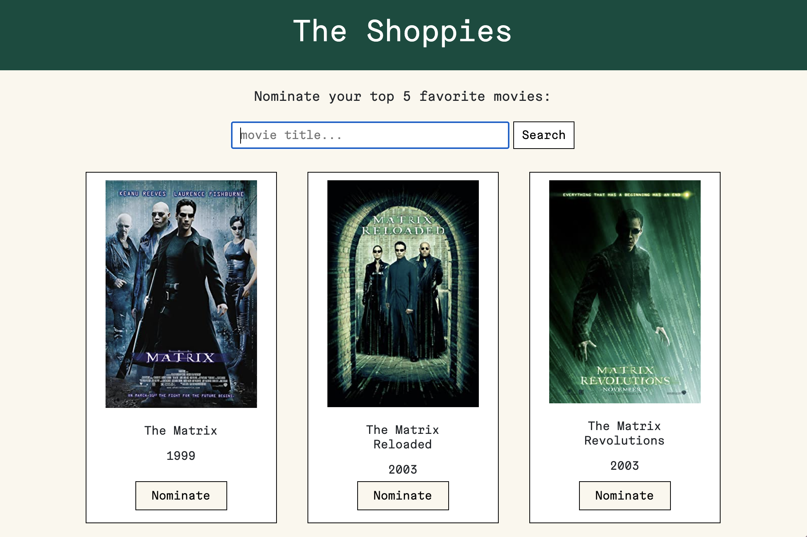
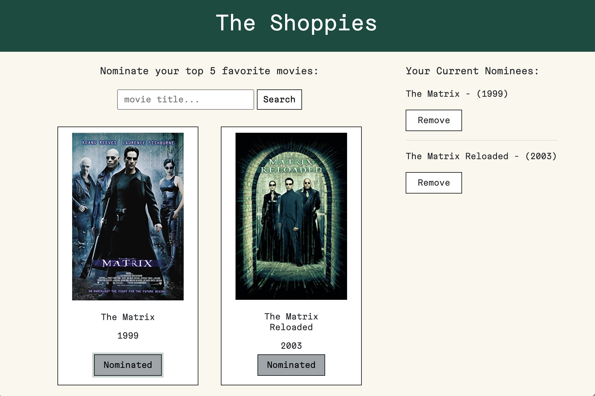
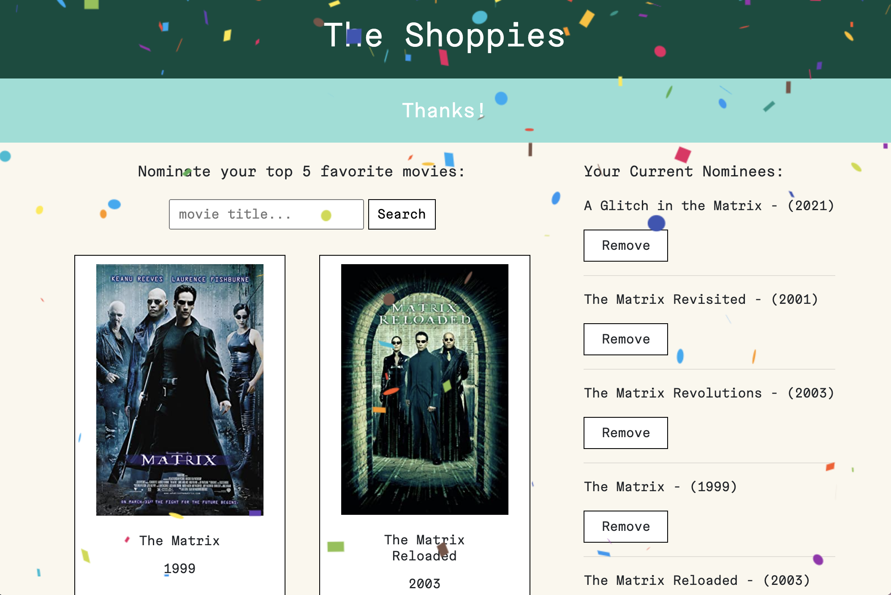

# the-shoppies
An app to help manage movie nominations for the Shoppies Awards. Submission for the Shopify UX Developer Intern & Web Developer Intern Challenge - Fall 2021

# [🔗 View Deployed App](https://shoppies-movie-app-ac.netlify.app/)

## Table Of Contents
* [Challenge](#The-Challenge)
* [Technical Requirementes](#Technical-Requirements)
* [Stack](#Stack)
* [Features](#Features)
* [Next Steps](#Next-Steps)

---
## The Challenge

* Build webpage that searches OMDB API for movies
* Allow users to nominate up to 5 favorite films
* Notify user when they're finished
* Simple and intuitive UI

### Setup

1.  `npm install`
2.  `npm start`

### Technical Requirements

* The ability to search the OMDB API and return a list of movies that show at least the title, release year and a button to nominate them.
* Search results should only be of movies.
* Updates to the search terms should update the result list.
* If a movie has been nominated already, it's button should be disabled within in search results.
* Nominated movies should move to their own "Nomination List".
* Movies in the nomination list should be able to be removed.
* Display a banner when the user has 5 nominations.
[Back To Top](#Table-Of-Contents)

---
## Tech Used
* React.js (Hooks)
* Axios
* Bootstrap / React Bootstrap
* React Dom
* OMDB API
* Dot ENV
* Node SASS
* Local Storage
* Netlify

[Back To Top](#Table-Of-Contents)

---
## Features
### Extras
* Nominations persisted in local storage
* Animations
* Clean an intuitive design and layout

[Back To Top](#Table-Of-Contents)

---
## Next Steps
* Add a pop out drawer for the nominations
* Add animations to the navbar that act as a counter for how many nominations given so far
* Add a popover response to clicking on the `Nominate` button

[Back To Top](#Table-Of-Contents)
